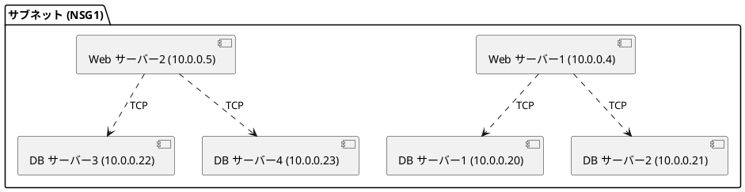
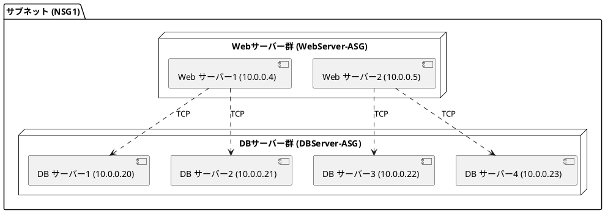

## 仮想ネットワーク
- クラウド上の独自のプライベートネットワーク
- 物理的ネットワークとは異なる論理的なネットワーク
- 自由に設定可能だが、設計時には注意が必要

### 主な検討ポイント
- 仮想ネットワークのパラメータ (名前やリージョンなど)
- サブネット (ネットワークの分割と通信制御)
- ネットワークインターフェース (仮想マシンへのIPアドレス割り当て)
- ネットワーク上の接続 (オンプレミスや他仮想ネットワークへの接続)

### 仮想ネットワークを作成上の注意点
アドレス空間が重複していると、ネットワークや今後作成する仮想ネットワークとの通信ができなくなる
- オンプレミス環境との接続
  - オンプレミスネットワークとAzure仮想ネットワークをVPN GatewayやExpressRouteで接続する場合
- 仮想ネットワーク間の接続
  - ピアリング (VNet Peering) を利用して複数の仮想ネットワークを接続する場合
- 未来のネットワーク計画
  - 将来的な仮想ネットワークやサブネットのアドレス空間が現在のネットワークと重複すると、新しいネットワークを正しく構成できなくなる
- サードパーティのシステムや他のクラウドサービスとAzureネットワークを連携する場合
- サブネット作成時
  - 仮想ネットワークの中で複数のサブネットを設定する場合
  - サブネット内のIPアドレスが重複すると、リソースへの通信が不安定になる

### サブネット作成時の注意点
- 仮想ネットワークは一つ以上のサブネットに分離可能
- IPアドレスの重複を避ける必要あり
- 小さいサブネットでは想定したIPアドレスが使えない場合がある
  - Azureで予約されるIPアドレスがあり、例として/24の場合は251個利用可能
  - 予約されるのは先頭4つと最後の1つのIPアドレス

### IPアドレスについて
- **種類**
  - パブリックIPアドレス (インターネットとの通信)
  - プライベートIPアドレス (社内ネットワークとの通信)
    - 仮想ネットワーク
    - オンプレミスネットワーク
    - VPNゲートウェイ
    - ExpressRoute
- **割り当て方法**
  - 動的割り当て (再作成時にアドレス変更の可能性あり)
  - 静的割り当て (IPアドレスを固定化)
###

## ネットワークセキュリティグループ (NSG)
- Azureネットワーク通信のトラフィックを制御
- ファイアウォールのような役割を果たす基本的なセキュリティ設定
- NSGルールの構成要素
  - アクセス元や接続先、ポート、プロトコル
  - アクション (許可または拒否)
  - 優先度 (数値が小さいルールが優先される)
  - ルールの名前
- デフォルトのルールと優先度
  - **受信**
    - 65000: 同じ仮想ネットワークやピアリングされた仮想ネットワークを許可
    - 65001: ロードバランサーからの通信を許可
    - 65500: その他の通信は拒否
  - **送信**
    - 65000: 同じ仮想ネットワークやピアリングされた仮想ネットワークを許可
    - 65001: インターネットへの通信を許可
    - 65500: その他の通信は拒否
- 推奨設定
  - サブネット単位で設定することで管理を簡素化
  - NICにも設定は可能であるが個々に設定すると煩雑になるため上位のサブネット単位に設定することが推奨される
- NSGの利用シナリオ
  - 仮想マシンへのトラフィック制御
    - リモートデスクトップ接続のためにRDPを許可
    - Webサーバーとして運用するためにHTTP/HTTPSを許可

## アプリケーションセキュリティグループ (ASG)
- 仮想マシンを役割別にグルーピングしてNSG設定を簡素化する機能
- 主なメリット
  - IPアドレス指定の手間が不要
  - 仮想マシンの役割を明確化

### ASGの利用シナリオ
役割の異なる複数の仮想マシンで構成されたアプリケーション(例えば3層アーキテクチャー)を運用時に有効です。

[Microsoft Azure Administrator教科書 第6章 NSG](https://book.impress.co.jp/books/1120101160)の説明がわかりやすかったため、構成例を拝借します。
例えば、以下のように1つのサブネットに複数のWebサーバーとDBサーバーを配置している場合、1つのNSGに全ての組み合わせ別のルールを設定する必要があります。

このような構成の場合、NSG1には以下のルールを設定する必要があります
| **ルール名** | **優先度** | **方向** | **送信元** | **送信元ポート範囲** | **宛先** | **宛先ポート範囲** | **プロトコル** | **アクション** |
|-------------|------------|---------|-----------|---------------------|----------|------------------|----------------|---------------|
| AllowInboundWeb1 | 100 | Inbound | サービスタグ: `Internet` | * | Webサーバー1 (`10.0.0.4`) | 80 (HTTP), 443 (HTTPS) | TCP | Allow |
| AllowInboundWeb2 | 101 | Inbound | サービスタグ: `Internet` | * | Webサーバー2 (`10.0.0.5`) | 80 (HTTP), 443 (HTTPS) | TCP | Allow |
| AllowWeb1ToDB1  | 200 | Inbound | 10.0.0.4 | * | DBサーバー1 (`10.0.0.20`) | 1433(SQL Server) | TCP | Allow |
| AllowWeb1ToDB2 | 201 | Inbound | 10.0.0.4 | * | DBサーバー2 (`10.0.0.21`) | 1433(SQL Server) | TCP | Allow |
| AllowWeb2ToDB3 | 202 | Inbound | 10.0.0.5 | * | DBサーバー3 (`10.0.0.22`) | 1433(SQL Server) | TCP | Allow |
| AllowWeb2ToDB4 | 203 | Inbound | 10.0.0.5 | * | DBサーバー4 (`10.0.0.23`) | 1433(SQL Server) | TCP | Allow |

これをWebサーバー群とDBサーバー群の役割ごとにASGを設定することでASGに対してNSGを設定することができます。

| **ルール名** | **優先度** | **方向** | **送信元** | **送信元ポート範囲** | **宛先** | **宛先ポート範囲** | **プロトコル** | **アクション** |
|-------------|------------|---------|-----------|---------------------|----------|------------------|----------------|---------------|
| AllowInboundWeb | 100 | Inbound | サービスタグ: `Internet` | * | **WebServer-ASG** | 80 (HTTP), 443 (HTTPS) | TCP | Allow |
| AllowWebToDB | 200 | Inbound | **WebServer-ASG** | * | **DBServer-ASG** | 1433(SQL Server) | TCP | Allow |

## まとめ
これらの3つを正しく活用することで、Azureネットワークを効率的かつ安全に運用することが可能になります。

## 参考文献
https://book.impress.co.jp/books/1120101160

https://www.udemy.com/course/az-104-microsoft-azure-administrator-jp/?couponCode=KEEPLEARNING
